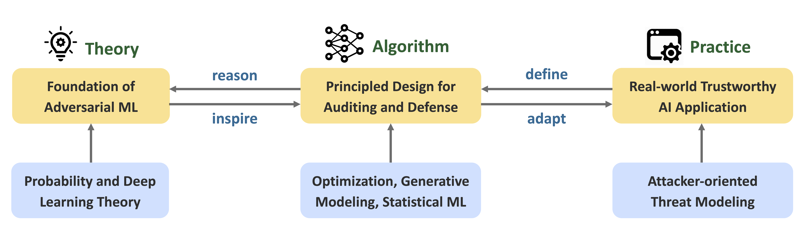

+++
widget = "custom"
active = true
date = "2021-05-04T00:00:00"

# Note: a full width section format can be enabled by commenting out the `title` and `subtitle` with a `#`.
title = "My Research"
# subtitle = "Leadership in formal education settings"

# Order that this section will appear in.
weight = 30

+++

 

My research is dedicated to addressing the fundamental challenges in building reliable and trustworthy AI systems, covering areas such as robustness, safety, privacy, bias, and interpretability. The current focus of my work is on **adversarial machine learning**. 

In particular, I study the dynamics of machine learning algorithms under worst-case scenarios, aiming to gain deeper theoretical insights into the mechanisms that drive robust generalization. I also develop principled approaches for auditing and mitigating vulnerabilities in ML systems against various types of adversaries, often leveraging techniques from optimization and statistical ML. On the practical side, I strive to bridge the gap between real-world applications and classical adversarial ML formulations by designing threat models that reflect the critical challenges most relevant in practice.

Ongoing research projects focus on topics such as subpopulation data poisoning, diffusion models, flow matching, generative AI safety, anti-facial recognition, AI-generated deepfakes, adversarial training and robust generalization, with applications in computer vision, natural language processing, cybersecurity, and biomedical domains. For more detailed information about these projects, please visit our [lab website](https://air-ml.org).

<!-- <h2>Theoretical Foundations of Adversarial ML</h2>

+ [Understanding intrinsic robustness via measuring concentration](https://arxiv.org/pdf/1905.12202)
+ [Understanding adversarially robust generalization](https://openreview.net/pdf?id=465Gv50E2N)
+ [Characterizing the optimality of data poisoning attack](https://openreview.net/pdf?id=yyLFUPNEiT)
+ [Membership inference & privacy auditing](https://arxiv.org/pdf/2406.11544)

<h2> General Aspects of Adversarial ML  </h2>

+ [Efficiency of adversarial ML algorithms](https://openreview.net/pdf?id=FjZsM7D9AT)
+ [Robustness certification](https://arxiv.org/pdf/2310.08732)
+ Adversarial patch attack
+ Subpopuation data poisoning attack
+ [Cost-sensitive robustness](https://openreview.net/pdf?id=BygANhA9tQ)

<h2>Adversarial ML Applications</h2>

+ Facial recognition
+ [Image captioning](https://arxiv.org/pdf/2406.05874)
+ Human pose estimation
+ Interpretable models

<h2> Generative AI Safety </h2>

+ [Jailbreak attacks & defenses on LLMs](https://arxiv.org/pdf/2403.04783)
+ Prompt injection attacks on LLMs
+ Diffusion models -->
 